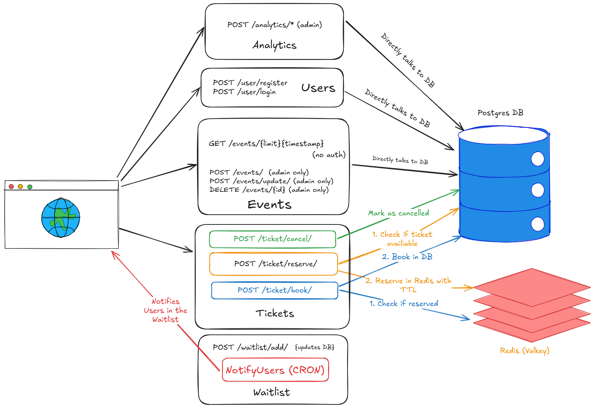
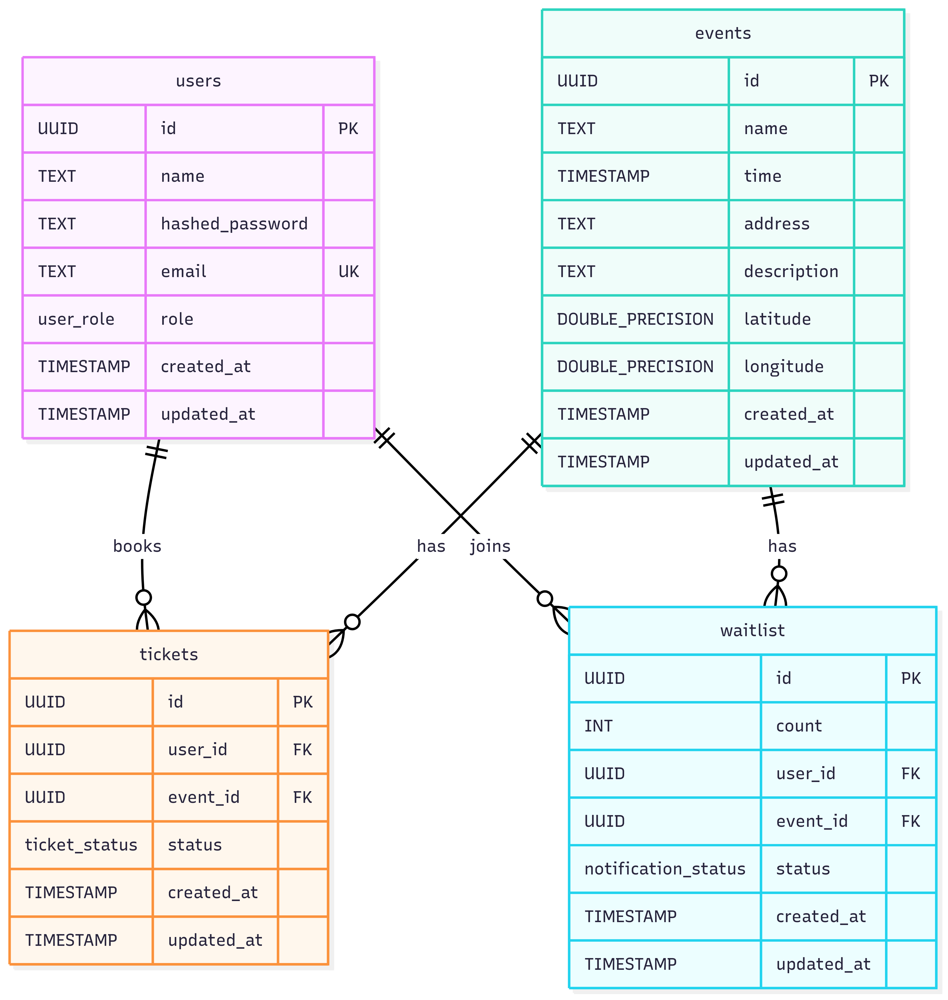

# Booked - Event Ticket Booking System

## Architecture Diagram


## ER Diagram


## Documentation

### API Documentation
#### Authentication
- **JWT Bearer Token**: Most endpoints require authentication via JWT token in the Authorization header
- **Format**: `Authorization: Bearer <jwt_token>`
- **Admin Role**: Some endpoints require admin privileges

#### Error Response Format
All errors follow this structure:
```json
{
  "category": "string",
  "category_code": "string", 
  "msg": "string",
  "error": "error_details" // optional
}
```

---

### 1. Health Check

#### GET /health/
**Description**: Health check endpoint  
**Authentication**: None required  
**Request**: No body  
**Response**:
```json
{
  "health": "ok",
  "message": "Hello from booked!"
}
```
**Status Codes**: 200 OK

---

### 2. User Management

#### POST /user/register/
**Description**: Register a new user  
**Authentication**: None required  
**Request Body**:
```json
{
  "name": "string",
  "email": "string", 
  "password": "string"
}
```
**Response**: No body (201 Created)  
**Status Codes**:
- 201 Created - User registered successfully
- 400 Bad Request - Invalid JSON or validation error
- 500 Internal Server Error - System error

**Possible Errors**:
- `SYS-01` - JSON decode error
- `USER-07` - Empty email
- `USER-08` - Empty name
- `USER-02` - Empty password

#### POST /user/login/
**Description**: Login user and get JWT token  
**Authentication**: None required  
**Request Body**:
```json
{
  "email": "string",
  "password": "string"
}
```
**Response**:
```json
{
  "token": "string"
}
```
**Status Codes**:
- 200 OK - Login successful
- 400 Bad Request - Invalid JSON
- 401 Unauthorized - Invalid credentials
- 500 Internal Server Error - System error

**Possible Errors**:
- `SYS-01` - JSON decode error
- `USER-03` - User not found
- `USER-04` - Invalid password

#### GET /user/bookings/
**Description**: Get user's past bookings  
**Authentication**: JWT required  
**Request**: No body  
**Response**:
```json
[
  {
    "event_id": "string",
    "event_name": "string",
    "event_unix_time": 1234567890,
    "event_address": "string",
    "event_description": "string",
    "event_latitude": 12.34, // optional
    "event_longitude": 56.78, // optional
    "number_of_tickets": 2,
    "booking_unix_time": 1234567890
  }
]
```
**Status Codes**:
- 200 OK - Bookings retrieved successfully
- 401 Unauthorized - Invalid or missing token
- 500 Internal Server Error - System error

---

### 3. Event Management

#### POST /event/
**Description**: Create a new event (Admin only)  
**Authentication**: JWT + Admin role required  
**Request Body**:
```json
{
  "name": "string",
  "unix_time": 1234567890,
  "address": "string",
  "description": "string",
  "latitude": 12.34, // optional
  "longitude": 56.78, // optional
  "seat_count": 100
}
```
**Response**: No body (201 Created)  
**Status Codes**:
- 201 Created - Event created successfully
- 400 Bad Request - Invalid JSON or validation error
- 401 Unauthorized - Invalid token or not admin
- 500 Internal Server Error - System error

**Possible Errors**:
- `SYS-01` - JSON decode error
- `EVENT-01` - Invalid seat count
- `EVENT-04` - Invalid new event data

#### GET /event/?limit=XX?timestamp=XXX
**Description**: Get paginated list of events  
**Authentication**: None required  
**Query Parameters**:
- `limit` (optional): Number of events to return (default: 10)
- `timestamp` (optional): Unix timestamp for pagination

**Response**:
```json
{
  "next_time_to_fetch": 1234567890,
  "events": [
    {
      "id": "string",
      "name": "string",
      "unix_time": 1234567890,
      "address": "string",
      "description": "string",
      "seat_count": 100,
      "available_seats_count": 50,
      "latitude": 12.34, // optional
      "longitude": 56.78 // optional
    }
  ]
}
```
**Status Codes**:
- 200 OK - Events retrieved successfully
- 500 Internal Server Error - System error

#### DELETE /event/
**Description**: Delete an event (Admin only)  
**Authentication**: JWT + Admin role required  
**Query Parameters**:
- `id`: Event ID to delete

**Response**: No body (200 OK)  
**Status Codes**:
- 200 OK - Event deleted successfully
- 400 Bad Request - Event not found
- 401 Unauthorized - Invalid token or not admin
- 500 Internal Server Error - System error

**Possible Errors**:
- `EVENT-03` - No event found

#### POST /event/update/
**Description**: Update an event (Admin only)  
**Authentication**: JWT + Admin role required  
**Request Body**:
```json
{
  "id": "string",
  "name": "string", // optional
  "unix_time": 1234567890, // optional
  "address": "string", // optional
  "description": "string", // optional
  "latitude": 12.34, // optional
  "longitude": 56.78, // optional
  "seat_count": 100 // optional
}
```
**Response**: No body (201 Created)  
**Status Codes**:
- 201 Created - Event updated successfully
- 400 Bad Request - Invalid JSON or validation error
- 401 Unauthorized - Invalid token or not admin
- 500 Internal Server Error - System error

**Possible Errors**:
- `SYS-01` - JSON decode error
- `EVENT-05` - Can't reduce seat count

---

### 4. Ticket Management

#### POST /ticket/reserve/
**Description**: Reserve tickets for an event  
**Authentication**: JWT required  
**Request Body**:
```json
{
  "event_id": "string",
  "count": 2
}
```
**Response**:
```json
{
  "ticket_ids": ["uuid1", "uuid2"]
}
```
**Status Codes**:
- 200 OK - Tickets reserved successfully
- 400 Bad Request - Invalid JSON or validation error
- 401 Unauthorized - Invalid token
- 500 Internal Server Error - System error

**Possible Errors**:
- `SYS-01` - JSON decode error
- `SYS-03` - Invalid UUID

#### POST /ticket/book/
**Description**: Book previously reserved tickets  
**Authentication**: JWT required  
**Request Body**:
```json
{
  "ticket_ids": ["uuid1", "uuid2"]
}
```
**Response**: No body (200 OK)  
**Status Codes**:
- 200 OK - Tickets booked successfully
- 400 Bad Request - Invalid JSON or validation error
- 401 Unauthorized - Invalid token
- 500 Internal Server Error - System error

**Possible Errors**:
- `SYS-01` - JSON decode error
- `TICKET-02` - Ticket not reserved

#### POST /ticket/cancel/
**Description**: Cancel booked tickets  
**Authentication**: JWT required  
**Request Body**:
```json
{
  "event_id": "string",
  "count": 2
}
```
**Response**: No body (200 OK)  
**Status Codes**:
- 200 OK - Tickets cancelled successfully
- 400 Bad Request - Invalid JSON or validation error
- 401 Unauthorized - Invalid token
- 500 Internal Server Error - System error

**Possible Errors**:
- `SYS-01` - JSON decode error
- `SYS-03` - Invalid UUID
- `TICKET-01` - Too few tickets
- `TICKET-03` - Not your ticket

---

### 5. Analytics (Admin Only)

#### GET /analytics/
**Description**: Get total bookings analytics for all events, includes analytics like the number of tickets booked today and the capacity utilisation of the venue, the list is sorted by capacity utilsation (decreasing) indicating the most popular events. \
**Authentication**: JWT + Admin role required  
**Request**: No body  
**Response**:
```json
[
  {
    "event_id": "string",
    "total_seats": 100,
    "sold_tickets": 75,
    "capacity_utilisation": 0.75,
    "today_booked_tickets": 10
  }
]
```
**Status Codes**:
- 200 OK - Analytics retrieved successfully
- 401 Unauthorized - Invalid token or not admin
- 500 Internal Server Error - System error

#### GET /analytics/cancellation_rates/
**Description**: Get cancellation rates for all events  
**Authentication**: JWT + Admin role required  
**Request**: No body  
**Response**:
```json
[
  {
    "event_id": "string",
    "cancellation_rate": 0.15
  }
]
```
**Status Codes**:
- 200 OK - Cancellation rates retrieved successfully
- 401 Unauthorized - Invalid token or not admin
- 500 Internal Server Error - System error

---

### 6. Waitlist Management

#### POST /waitlist/add/
**Description**: Add user to event waitlist  
**Authentication**: JWT required  
**Request Body**:
```json
{
  "event_id": "string",
  "count": 2
}
```
**Response**: No body (200 OK)  
**Status Codes**:
- 200 OK - Added to waitlist successfully
- 400 Bad Request - Invalid JSON or validation error
- 401 Unauthorized - Invalid token
- 500 Internal Server Error - System error

**Possible Errors**:
- `SYS-01` - JSON decode error
- `SYS-03` - Invalid UUID
- `WAITLIST-01` - Already in waitlist
- `WAITLIST-02` - Invalid waitlist count

---

### Error Categories and Codes

#### System Errors (SYS)
- `SYS-01` - JSON decode error
- `SYS-02` - Unknown error
- `SYS-03` - Invalid UUID

#### User Errors (USER)
- `USER-01` - Invalid user role
- `USER-02` - Empty password
- `USER-03` - User not found
- `USER-04` - Invalid password
- `USER-05` - JWT sign failure
- `USER-06` - Invalid token
- `USER-07` - Empty email
- `USER-08` - Empty name

#### Event Errors (EVENT)
- `EVENT-01` - Invalid seat count
- `EVENT-02` - Invalid event ID
- `EVENT-03` - No event found
- `EVENT-04` - Invalid new event
- `EVENT-05` - Can't reduce seat count

#### Ticket Errors (TICKET)
- `TICKET-01` - Too few tickets
- `TICKET-02` - Ticket not reserved
- `TICKET-03` - Not your ticket

#### Waitlist Errors (WAITLIST)
- `WAITLIST-01` - Already in waitlist
- `WAITLIST-02` - Invalid waitlist count

#### Database Errors (DB)
- `DB-01` - Database read error
- `DB-02` - Database write error
- `DB-03` - Database transaction error
